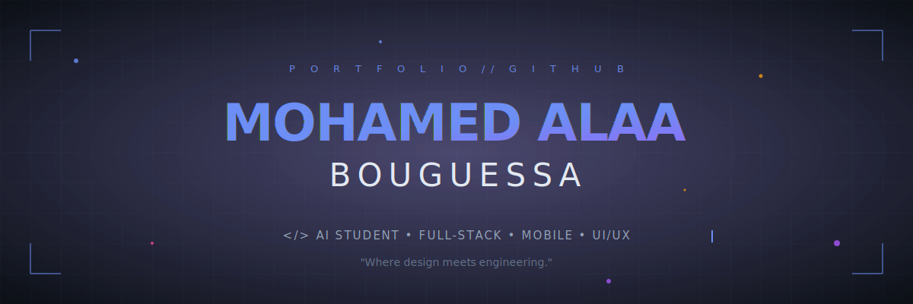

<!-- ============================================== -->
<!--      HERO — custom animated SVG banner         -->
<!-- ============================================== -->

  

  
  
  
  

 

<!-- ============================================== -->
<!--                  ABOUT — terminal              -->
<!-- ============================================== -->

## `>` whoami

🎓   AI Student based in Algeria 🇩🇿
💻   Full-Stack & Mobile Developer — building web and mobile apps end-to-end
🎨   UI/UX Designer — I care about how things look and feel
🧪   Currently exploring Deep Learning and advanced React patterns
⚡   Fun fact: I bridge design and code — pixels and logic
📫   Reach me at alabouguessa3@gmail.com
 

<!-- ============================================== -->
<!--                  TECH STACK                    -->
<!-- ============================================== -->

## `>` arsenal

<table align="center">
  <tr>
    <td align="center" width="160"><b>Languages</b></td>
    <td></td>
  </tr>
  <tr>
    <td align="center"><b>Frontend / Mobile</b></td>
    <td></td>
  </tr>
  <tr>
    <td align="center"><b>AI / ML</b></td>
    <td></td>
  </tr>
  <tr>
    <td align="center"><b>Tools</b></td>
    <td></td>
  </tr>
</table>

 

<!-- ============================================== -->
<!--                  STATS                         -->
<!-- ============================================== -->

## `>` metrics

  
  

  

  

 

<!-- ============================================== -->
<!--                  PROJECTS                      -->
<!-- ============================================== -->

## `>` featured.projects

<table>
  <tr>
    <td colspan="2" valign="top">
      <h3 align="center">🧠 &nbsp; Epilepsy Detection Platform</h3>
      

        Full-stack EEG-based system for monitoring and detecting epileptic activity. 
        Includes an <b>EEG Reader</b>, a <b>Simulator</b> for testing, a <b>Backend</b> for signal processing, 
        and <b>Neurix</b> — a chatbot built to assist patients and clinicians.
      

      

        
        
        
        
        
      

      

        
      

    </td>
  </tr>
  <tr>
    <td width="50%" valign="top">
      <h3 align="center">🛡️ &nbsp; AML — Anti-Money Laundering</h3>
      

        Machine learning system designed to detect suspicious financial transactions
        and flag potential money laundering patterns.
      

      

        
        
        
      

      

        
      

    </td>
    <td width="50%" valign="top">
      <h3 align="center">💼 &nbsp; Hirevo</h3>
      

        Job platform connecting talent with opportunity — clean UX, modern stack,
        built around a smooth candidate flow.
      

      

        
        
        
      

      

        
      

    </td>
  </tr>
</table>

 

<!-- ============================================== -->
<!--              ACTIVITY GRAPH                    -->
<!-- ============================================== -->

## `>` contribution.graph

  

 

<!-- ============================================== -->
<!--                  CONNECT                       -->
<!-- ============================================== -->

## `>` connect

  
  
  

 

  <i>Built with care · refreshed often · <code>v2.0</code></i>

